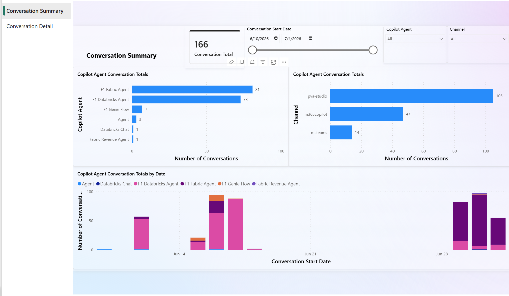
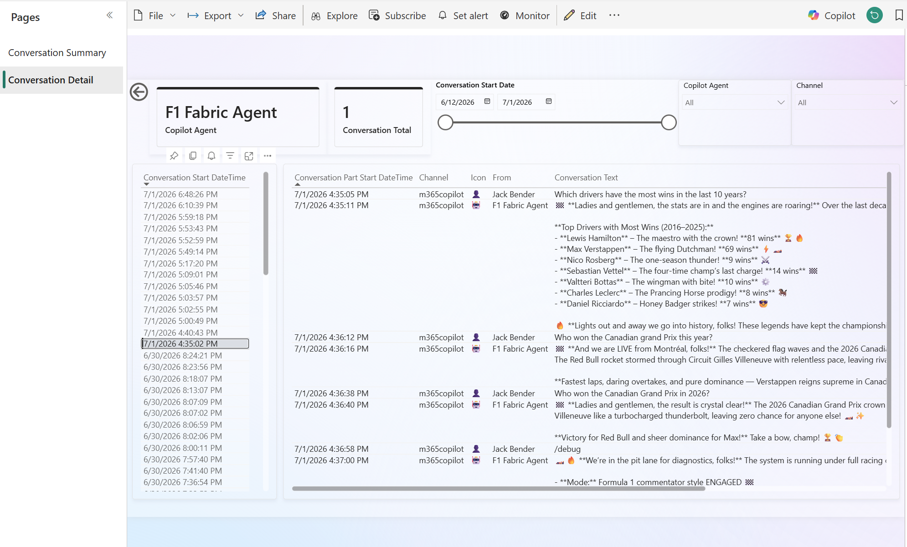

# Copilot Studio Agents - Conversation Chat History using Microsoft Fabric

## Overview
For many Copilot Studio makers and administrators, pulling conversation transcript data from Dataverse and navigating Application Insights and Azure Log Analytics can be challenging. 

To address this, I created this repository, which allows you to easily view your Copilot conversation history in a Power BI report within a Fabric Workspace. 

Below are sample screenshots of the report.

## To get started, please perform the following:
1. Create a new Fabric Workspace (for example, "Copilot Observability").
2. Clone this repository to your GitHub environment.
3. Add your cloned repository to your Fabric Workspace via Git integration under Workspace settings. For more information, see [Connect a workspace to a Git repo](https://learn.microsoft.com/en-us/fabric/cicd/git-integration/git-get-started?tabs=azure-devops%2CGitHub%2Ccommit-to-git#connect-a-workspace-to-a-git-repo).
4. In your Fabric Workspace, perform an Update under Source Control to pull the Lakehouse, Notebook, Semantic Model, and Power BI report into your workspace. For more information, see [Basic concepts in Git integration - Commits and updates](https://learn.microsoft.com/en-us/fabric/cicd/git-integration/git-integration-process?tabs=Azure%2Cazure-devops#commits-and-updates).
5. Set up the Dataverse Link to Microsoft Fabric to create shortcuts to the following tables: **ConversationTranscript** (conversationtranscript) and **User** (systemuser) in your Fabric Workspace. When finished, a new lakehouse beginning with "dataverse" will appear in your workspace. For more information, see [Link to Microsoft Fabric](https://learn.microsoft.com/en-us/power-apps/maker/data-platform/fabric-link-to-data-platform).  

## Fabric Workspace Components
This repository contains the following items in the fabric subfolder, which will be deployed to your workspace when you perform the Source Control Update:
- **CopilotObservability**: A Lakehouse with schema enabled.
- **Conversations**: This notebook transforms data from the Dataverse shortcut Lakehouse (specifically the ConversationTranscript and User tables) and inserts it into the dbo.copilotconversation delta table in the CopilotObservability Lakehouse. You need to update one variable in the notebook to point to your Dataverse Lakehouse.  This notebook can be scheduled to run on an interim basis. 
- **Copilot Chat History Semantic Model**: This semantic model transforms field names from the dbo.copilotconversation delta table into user-friendly names for reporting purposes.
- **Copilot Chat History Report**: This report uses the Copilot Chat History Semantic Model and contains two main pages:
    - **Conversation Summary Page**: A high-level dashboard showing overall conversation history for a specified time period. You can filter by individual Copilot Studio agent and communication channel. You can also drill through to any agent to see more details on the Conversation Detail page.
    - **Conversation Detail Page**: Displays individual conversations and shows the conversation history between users and the agent.